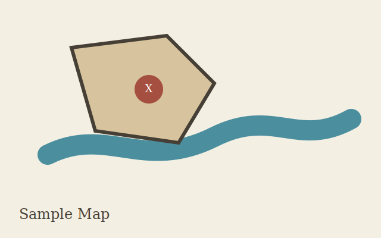

---
aliases:
- Home
fields:
  Day: '54'
tags:
- sample
- guide
- session
title: Sample World Guide
type: index
---

# Sample World Guide

Welcome to the native VirtualScreen guide. This world is small on purpose: every link opens a real file you can inspect, send to the player screen, search, peek, or use in a tool.

## Try the basics

- Open [[Guide/01 Notes And Links.md|Guide 01 - Notes And Links]] to test Markdown notes, wiki links, backlinks, and Peek.
- Open [[Guide/02 Cards And Tables.md|Guide 02 - Cards And Tables]] to inspect structured `.cs` cards, typed fields, computed fields, and CSV tables.
- Open [[Guide/03 Screen Map Audio.md|Guide 03 - Screen Map Audio]] to try player-screen display, maps, media, and audio.
- Open [[Guide/04 Scripts And Live Tools.md|Guide 04 - Scripts And Live Tools]] to run `.dms` scripts and explore Capture, Prep Check, HP, snapshots, bindings, and path picking.

## Useful samples

- NPC note: [[NPCs/Captain Ilyra]]
- NPC card: [[Cards/Harbor Watch Contact.cs]]
- Character sheet: [[Cards/Basic Character Sheet.cs]]
- Computed sheet: [[Cards/Computed Character Sheet.cs]]
- Reference table card: [[Cards/Item Reference Table.cs]]
- Random event table: [[Tables/random-events.csv]]
- Dice roll table: [[Tables/dice-rolls.csv]]
- Map image: [[Media/sample-map.svg]]
- Screen/audio DMS demo: [[Scripts/screen_audio_demo.dms]]

